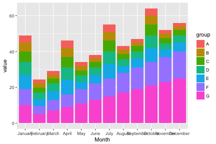
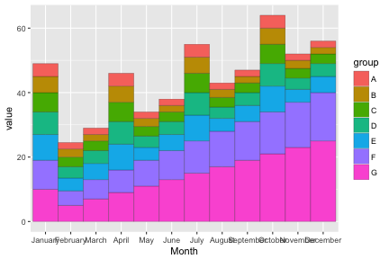
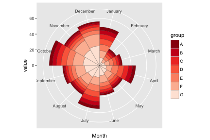

In 1858 nurse, statistician, and reformer Florence Nightingale published *Notes on Matters Affecting the Health, Efficiency, and Hospital Administration of the British Army. Founded Chiefly on the Experience of the Late War. Presented by Request to the Secretary of State for War.* This privately printed work contained a color statistical graphic entitled "Diagram of the Causes of Mortality in the Army of the East" which showed that epidemic disease, which was responsible for more British deaths in the course of the Crimean War than battlefield wounds, could be controlled by a variety of factors including nutrition, ventilation, and shelter. The graphic, which Nightingale used as a way to explain complex statistics simply, clearly, and persuasively, has become known as Nightingale's "Rose Diagram." 
(http://www.historyofinformation.com/expanded.php?id=3815)

## Prerequisite

You have to install the developmental version of R package `editData` from github.


```r
#install.packages("devtools")
devtools::install_github("cardiomoon/editData")
```

## Install package

You can install `ggplotAssist` package from github. 


```r
#install.packages("devtools")
devtools::install_github("cardiomoon/ggplotAssist")
```

## What is the rose plot?

A rose plot is a stacked bar plot with polar coordinate. With ggplot2, you can make the rose plot easily.

## Data

I will use the `rose` data included in package ggiraphExtra. The rose data is a phony dataset representing rose sales. 


```r
library(ggiraphExtra)
head(rose)
```

```
# A tibble: 6 x 3
     Month group value
    <fctr> <chr> <dbl>
1  January     G    10
2 February     G     5
3    March     G     7
4    April     G     9
5      May     G    11
6     June     G    13
```

Alternatively, you can download the `rose.csv` file from my github using the following code.


```r
library(readr)
url <- "https://raw.github.com/cardiomoon/ggplotAssistFigures/master/rose.csv"
rose=read_csv(url)
```

```
Parsed with column specification:
cols(
  Month = col_character(),
  group = col_character(),
  value = col_double()
)
```

```r
rose$Month=factor(rose$Month,levels=month.name)
```

## R code for rose plot

### 1. Make a bar plot

First, make a bar plot. In this plot the height of bar represent values in the data.


```r
require(ggplot2)
ggplot(data=rose,aes(x=Month,y=value,fill=group))+geom_bar(stat="identity")
```



### 2. Adjust options for bar graph

The default bar width is 0.9(90% of the resolution of data). To remove the spaces between the bars, set the width of bar 1 and the boundary color "black" and the thickness of line 0.1.


```r
ggplot(data=rose,aes(x=Month,y=value,fill=group))+
    geom_bar(stat="identity",width=1,color="black",size=0.1)
```



### 3. Apply polar coordinate


To make a rose plot, apply polar coordinate with coord_polar(). Apply "Reds" palette with scale_fill_brewer().


```r
ggplot(data=rose,aes(x=Month,y=value,fill=group))+
    geom_bar(stat="identity",width=1,color="black",size=0.1)+
    coord_polar()+
    scale_fill_brewer(palette="Reds",direction=-1)
```



## Make a rose plot with ggplotAssist - Standard method

1. In RStudio, Select File ... New File...R script. To use data rose, highlight the data name `rose`(1). Execute ggplotAssist addin(arrow), to interactively manipulate it.


2. To mapping the variables, select `x` among aesthetics and `Month` among mapping. Select `y` among aesthetics and `value`. Select `fill`(1) and `group`(arow) to map the fill variable. 


3. Press `geom` button(1). Select `geom_bar`(2). Select `identity` as stat(3). To set the color argument of geom_bar(), select `color`(4) and enter `black`(5) and select `addquote` checkbox(6). The R code for this layer is shown(7) and you can see the plot preview at lower right corner(8).


4. Set the `size`(9) of bar `0.1`(10). To remove the spaces between the bars, set the `width` of bar 1(11). You can see the R code for this layer(scarlet rectangle). Press `Add Layer` button to add this layer.


5. To apply `Reds` palette to this plot, press `scale` button(12). Select scale_fill_brewer(13) and select `Reds` palette(14) and set the direction of palette -1(15). Press `Add layer` button to add this layer(16). 


6. To apply ploar coordinate, press `coord` button(17). Select `coord_polar`(18) and press `Add Layer` button(19).


7. You can see the plot layer by layer. Press the `Layer by layer` button(20) and press the arrow head(arrow). You can see the plot layer by layer.


## Make a rose plot with ggplotAssist - A shortcut

1. After maaping the variables, press the `geom` button(1). Select `geom_bar`(2) among geoms and set the stat `identity`(3). You can see the R code for this layer(4) and the plot preview(5). Press the `Make a Rose Plot` button(6) and you can get the rose plot. 


2. Press the `Done` button(arrow).


3. The code for the rose plot will be emitted at the cursor position(scarlet rectangle).


